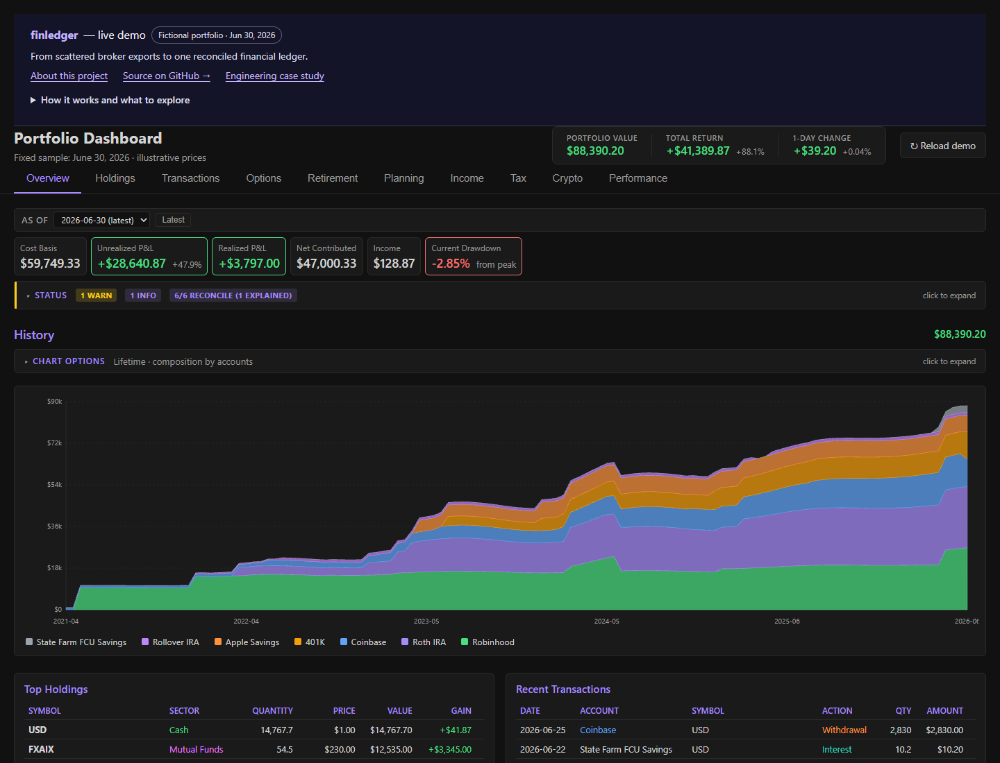
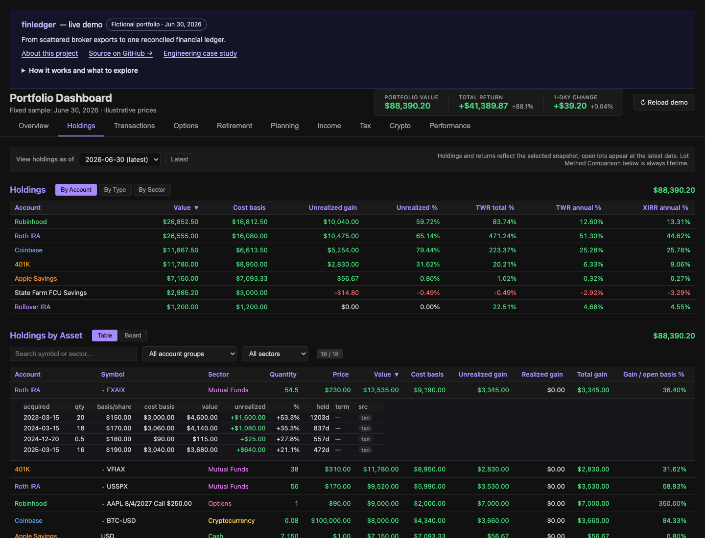

# finledger

finledger started as a personal project. It combines broker CSV exports into a
portfolio dashboard you can open locally as a single HTML file.

Most of the work is in handling overlapping exports, tracking cost basis when
assets move between accounts, and checking the results against broker statements.

[](https://akourk.github.io/finledger/)

**[Live demo](https://akourk.github.io/finledger/)** ·
[Engineering case study](docs/ENGINEERING_CASE_STUDY.md) ·
[Architecture](docs/ARCHITECTURE.md)

The demo and screenshots use fictional transactions and illustrative prices.

[](https://github.com/akourk/finledger/actions/workflows/tests.yml)

[](LICENSE)

## How it works

Each broker has a parser that converts its exports into a common transaction
format. From there, finledger merges the files, tracks lots and balances, and
compares its totals with broker figures you supply.

Two cases need particular care:

- If two exports contain the same purchase, importing both shouldn't count it
  twice. The merge handles that while keeping legitimate repeated transactions
  within a single file.
- Moving shares between accounts shouldn't reset their acquisition dates or
  cost basis. Those follow the lots through paired transfers. Incomplete history
  and differences from broker figures remain visible for review.

Python handles imports and calculations; the dashboard uses plain JavaScript,
CSS, and SVG. Everything needed to view it is in the HTML file, so there's no
server or database to run. Tests compare shared calculations in Python and
JavaScript and exercise imports, keyboard controls, and browser interactions.

## Try it locally

With Python 3.10+ and uv installed:

```bash
uv sync --locked --all-groups
uv run python -m tools.build_demo --output _site
```

Open `_site/index.html`. The sample is dated June 30, 2026 and builds in temporary
directories without reading your personal `data/` or market-data cache.
[Demo build details](docs/DEMO.md) explain the inputs and how they're checked
before deployment.

## Use your own exports

```bash
sh tools/install-hooks.sh
# Put broker CSV exports in data/.
uv run python -m src.main --init-account-mappings
# Review data/account-mappings.csv and copy its rows into data/metadata.csv.
uv run python -m src.main
```

Review the suggested account types and resolve any `REVIEW_REQUIRED` entries
before running the pipeline. Every account needs a type. The resulting dashboard
is at `exports/dashboard.html`.

Parsers are included for Robinhood, Coinbase, Coinbase Pro/GDAX, Schwab,
Vanguard and Voya retirement exports, USAA Victory Capital, Apple Savings,
and State Farm FCU. See the [format and metadata reference](docs/USAGE.md) for
supported variants and limitations.

## Dashboard

| Holdings | Performance | Tax |
|:---:|:---:|:---:|
| [](docs/img/holdings.png) | [](docs/img/performance.png) | [](docs/img/tax.png) |

You can inspect individual lots, look back at earlier holdings, compare returns,
or work through retirement and tax estimates. The demo also includes a
reconciliation difference with an explanation, so you can see how a mismatch
is reported.

## Development

You'll also need Node.js 22.12+ for the browser checks. GitHub Actions runs the
tests and deploys the same demo file that passed those checks.

```bash
uv sync --locked --all-groups
npm ci
sh tools/install-hooks.sh
uv run python -m pytest tests/ -q -rs
uv run python -m tools.build_demo --output _site
npm test
uv run python -m tools.privacy_guard scan --scope worktree
uv run python -m tools.privacy_guard scan --artifact _site
```

See [CONTRIBUTING](CONTRIBUTING.md) for the test workflow and checks to run before
committing or pushing.

## Privacy and limitations

Keep personal exports in `data/` and generated dashboards in `exports/`; both
are ignored by Git. A generated dashboard contains the full ledger, including
fields that aren't currently visible, so keep that HTML file private too.
Price and sector lookups use yfinance. The broker files themselves stay local.

The privacy hooks check staged files, commit metadata, and outgoing history.
Use your GitHub no-reply commit email and add private identifiers and distinctive
values to the ignored local denylist. These checks still need manual review:
they can't recognize every personal amount or read text in an image.
See [the privacy workflow](docs/PRIVACY.md) for setup and details.

**Not tax, financial, or investment advice.** Results depend on the completeness
of broker exports and declared metadata. Missing acquisition history, lot-relief
differences, and wash-sale treatment can cause disagreements. Reconcile against
broker statements and tax documents before relying on the output.

MIT — see [LICENSE](LICENSE).
