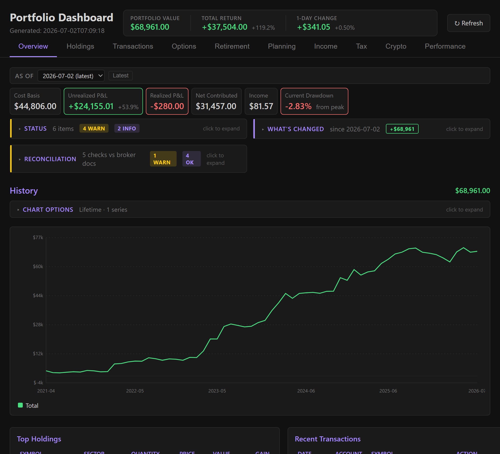
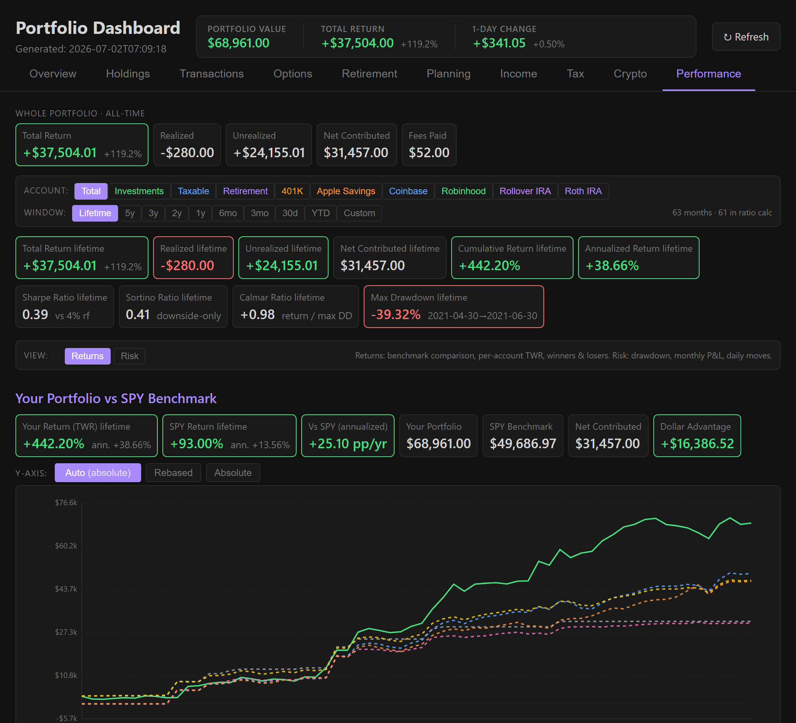
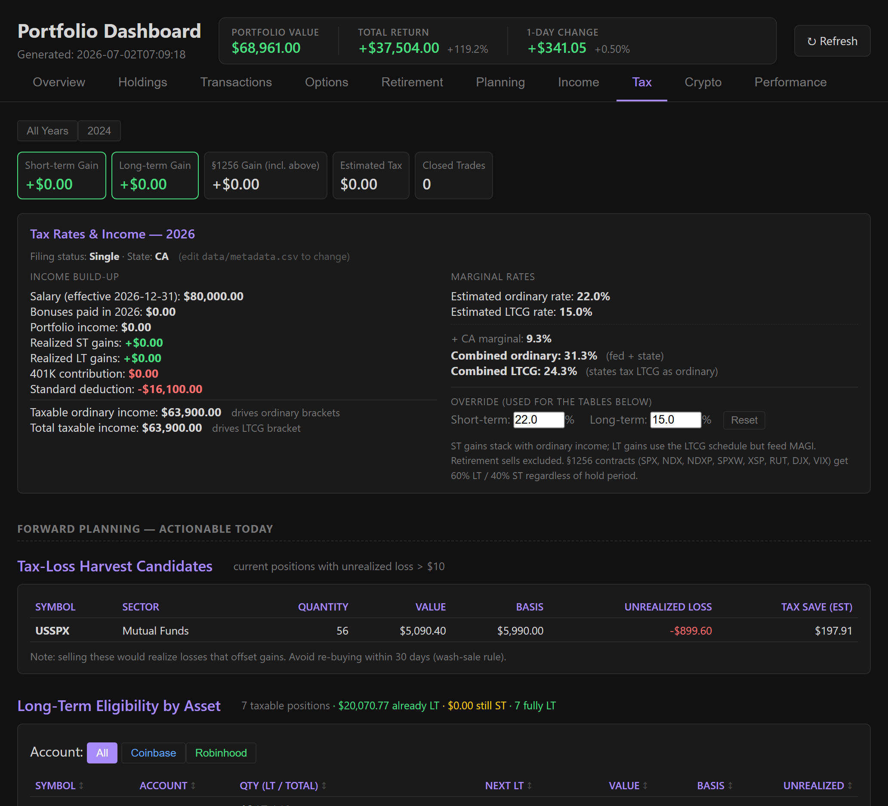

# fin

A personal portfolio tracker. Drop raw transaction CSVs from your brokerages
into `data/`, run one command, and get a clean HTML dashboard of your
holdings and every transaction ever — across every account, in one view.

No server, no database, no cloud. One Python script, one HTML file out.

## Screenshots

All screenshots are rendered from the bundled **fictional** sample portfolio
(`samples/portfolio.snapshot.json`) — no real financial data.

| Overview | Performance | Tax |
|:---:|:---:|:---:|
| [](docs/img/overview.png) | [](docs/img/performance.png) | [](docs/img/tax.png) |

> Regenerate the sample dashboard yourself (in a scratch dir, per the
> dev-loop): import the snapshot, then run the pipeline → `exports/dashboard.html`.

## What it does

1. **Scans** `data/` for broker CSV exports and auto-detects each one
   (Robinhood, Coinbase, Coinbase Pro / GDAX, Schwab, Vanguard 401K,
   Voya 401K, USAA Victory Capital, Apple Savings).
2. **Renames** them to a consistent scheme (`robinhood-1.csv`,
   `schwab-roth-ira.csv`, …).
3. **Parses** each into a common transaction schema.
4. **Deduplicates** across overlapping exports.
5. **Reconciles** known custodial transfers (USAA → Schwab Roth) that only
   one side reports.
6. **Normalizes** symbols (crypto tickers get `-USD` suffixes) and actions
   (every broker's flavor of "Buy", "Dividend", "Reinvest", etc. collapses
   to one vocabulary).
7. **Computes** running balances and current holdings per symbol and per
   account, with a dust filter that strips sub-penny residuals from
   CSV-precision mismatches.
8. **Classifies** each holding by sector (yfinance, cached locally).
9. **Fetches and caches historical prices** for every symbol you've ever
   held — split-adjusted but not dividend-adjusted, so each cached value
   matches the actual market close on that date — so portfolio value can
   be computed at any past date. Delisted / invalid tickers get an
   exponential backoff so failed fetches aren't retried every run.
10. **Tracks cost basis** per lot (FIFO), realized gain on every sell,
    and unrealized gain on every remaining position — with transfer
    pairing so moving shares between accounts preserves basis. Also
    computes totals under LIFO, HIFO, and Average-cost for side-by-side
    comparison.
11. **Builds a portfolio value time series** (monthly snapshots from your
    first transaction through today) broken down by account group,
    account type, and sector.
12. **Computes derived analytics** (single source of truth for figures
    multiple dashboard views consume): rollover-bridge detection,
    per-account TWR (Modified Dietz + Schwab-style daily for retirement),
    options stats with §1256 classification, tax bracket fill with
    YTD-to-EOY projection, concentration risk (HHI + top-5),
    drawdown / Sharpe / Sortino, dividend forecast, Monte Carlo
    retirement projection (with FIRE crossings if `Annual Expenses`
    is set), and a run-over-run diff.
13. **Emits** `exports/transactions.json` and a self-contained
    `exports/dashboard.html` — a tabbed single-page app with hash
    routing, mobile responsive, no external assets.

## Requirements

- Python 3.10+
- `yfinance` (only needed on first run for new symbols; sector lookups are
  cached in `cache/sector_cache.json` afterwards)

```bash
pip install yfinance
```

## Usage

### Try it with the sample portfolio

A synthetic, fictional portfolio is bundled in `samples/portfolio.snapshot.json`.
Drop it into a fresh checkout and run:

```bash
python -m src.main --import-snapshot samples/portfolio.snapshot.json
python -m src.main
```

Open `exports/dashboard.html` to see the dashboard populated with the
sample data.  Regenerate the sample bundle from
`tools/build_sample_snapshot.py` if you want to tweak it.

### Use your own data

```bash
# Drop your broker CSV exports into data/ (any filenames are fine — they'll
# be auto-detected and renamed).

python -m src.main
```

Options:

```bash
python -m src.main --dry-run             # preview renames, do nothing else
python -m src.main --skip-rename         # parse without renaming
python -m src.main -o path.json          # custom JSON output path
python -m src.main --refresh-prices      # re-price the existing export
                                         #   without re-parsing CSVs
python -m src.main --refresh-caches      # force-refresh splits cache and
                                         #   retry tombstoned tickers
python -m src.main --export-snapshot snap.json   # bundle data/ → 1 JSON file
python -m src.main --import-snapshot snap.json   # restore data/ from a snapshot
                                                 #   (--force to overwrite)
```

Open `exports/dashboard.html` in any browser. It's a single file with the
full dataset inlined — no network calls at view time.

### Portable snapshots

`--export-snapshot` bundles every CSV in `data/` into a single JSON file
(plain-text, diffable).  `--import-snapshot` restores it on the other
side.  Use this to move your portfolio between machines without copying
30+ files individually.  Existing files are preserved unless you pass
`--force`.

## Supported brokers

| Broker               | Account type        | Detection                                           |
| -------------------- | ------------------- | --------------------------------------------------- |
| Robinhood            | Taxable             | filename contains `robinhood`, or Robinhood headers |
| Coinbase             | Taxable             | filename contains `coinbase`, or Coinbase headers   |
| Coinbase Pro / GDAX  | Taxable             | filename contains `gdax` or `coinbase-pro`          |
| Schwab Rollover IRA  | Retirement          | Schwab `_transactions_` + `rollover_ira`            |
| Schwab Roth IRA      | Retirement          | Schwab `_transactions_` + `roth_contributory_ira`   |
| Vanguard 401K        | Retirement          | filename contains `vanguard401k`                    |
| Voya 401K            | Retirement          | filename contains `voya401k`                        |
| USAA Victory Capital | Retirement (Roth)   | filename contains `usaavictorycapital`              |
| Apple Savings        | Savings             | filename contains `apple-savings`                   |

You can also drop a `manual-adjustments.csv` for corrections that aren't in
any broker export (see `src/parsers/manual.py` for the column format).

### `metadata.csv` — personal info + project config

`metadata.csv` is a reserved filename for everything the broker exports
don't carry: birthday, salary, bonuses, expenses, year-end targets, and
optional account-mapping overrides.  Skipped by the transaction
pipeline but read by the Overview / Retirement / Planning / Income /
Tax tabs.  Each row is `Type,Date,Amount,Symbol,Note` where `Type`
is one of:

| Type              | Used by                                                                                          |
| ----------------- | ------------------------------------------------------------------------------------------------ |
| `Personal Info`   | Birthday (Note=`Birthday`) → Monte Carlo horizon, age math, Roth eligibility                     |
| `Salary History`  | Effective-as-of dates feed AGI / MAGI / Roth eligibility / cash-flow forecast / Year-by-Year     |
| `Bonus History`   | Per-event lump sums; the cash-flow forecast uses last full year as a planning estimate           |
| `Annual Expenses` | FIRE section: most recent × 25 = FI number (4% rule)                                             |
| `Target`          | Year-by-Year breakdown's Target column (Date = year, Amount = goal).  Suggested fallback uses Fidelity age × salary |
| `Account Group`   | Override `ACCOUNT_GROUPS` — Symbol = broker's raw account name, Note = simplified group key      |
| `Account Type`    | Override `ACCOUNT_TYPES` — Symbol = group key, Note = `Taxable` / `Retirement` / `Savings`       |
| `Filing Status`   | Note = `Single` / `Married Filing Jointly` / `Married Filing Separately` / `Head of Household` (default `Single`).  Drives federal + LTCG brackets, standard deduction, Roth MAGI phaseout window. |
| `State`           | Note = 2-letter state code (`WA`, `CA`, …).  Display label; pair with `State Tax Rate`.            |
| `State Tax Rate`  | Amount = marginal state income-tax rate as a decimal (`0.093`).  Added to the federal marginal for the Tax tab's combined rate + estimated capital-gains tax. |
| `Target Allocation` | Symbol = sector bucket (`ETFs`, `Cash`, …), Amount = target %.  Drives the Holdings tab's Target vs Actual rebalancing-drift view. |
| `Retirement Age`  | Amount = integer age (default `67`).  Drives Monte Carlo horizon + Planning tab projection-age default. |
| `Budget`          | A recurring living expense (rent, subscription, insurance…).  Symbol = category (`Housing`, `Subscriptions`, …), Amount = cost per period, Note = label with optional cadence suffix `@monthly` (default) / `@yearly` / `@quarterly` / `@6mo` / `@weekly`.  Date = effective-from; rows sharing a label supersede each other by date (rent increase = new row; `Amount = 0` cancels).  Drives the Income tab's Budget section + the cash-flow forecast's projected-savings line. |
| `Paycheck Deduction` | A recurring per-paycheck payroll line.  Symbol = kind (`Pre-Tax` / `Tax` / `Post-Tax` / `Withholding`), Amount = $ per paycheck (negative = a credit, e.g. a wellness refund), Note = label.  Pre-Tax rows reduce W-2 wages for AGI / MAGI / Roth eligibility; `Withholding` = voluntary extra federal withholding (reduces take-home, credited against the estimated year-end tax on realized gains); all rows feed the Income tab's Paycheck panel (gross → deductions → estimated take-home).  401(k) deferrals don't belong here — they're derived from the contribution transactions. |
| `Pay Frequency`   | Amount = pay periods per year (`12` / `24` / `26` / `52`, default `26` = biweekly).  Annualizes the paycheck rows. |
| `Tax Return`      | A figure from a filed 1040.  Date = tax year, Symbol = field (`Total Tax` = line 24, `AGI` = line 11, `Withholding` = line 25d, `Wages`, `Capital Gains`), Amount = $.  The prior year's Total Tax + AGI drive the Tax tab's **withholding safe-harbor check** (IRS Form 2210: 90%-of-current vs 100%/110%-of-prior-year, whichever is less). |
| `Lot Method`      | Symbol = account group, Note = `FIFO` / `LIFO` / `HIFO` — the lot-relief method that account's broker actually uses (e.g. Coinbase defaults to HIFO).  Affects realized gains / holding period, never balances. |
| `Cost Basis`      | True cost basis for an off-platform crypto receive fin can't reconstruct.  Symbol = account group, Date = acquired date, Amount = total basis, Note = `"<qty> <asset>"` (optional `#N` to disambiguate). |
| `Reconcile Balance` / `Reconcile Realized` / `Reconcile Income` / `Reconcile Section 1256` / `Reconcile Other Income` | Broker-reported ground truth (statement balance, 1099-B, 1099-DIV/INT, 1099-MISC) to check fin against — drives the Overview's Reconciliation panel.  Symbol = account group, Date = as-of date (balance) or year, Amount = the broker figure.  `Reconcile Realized` also overrides fin's realized figure in AGI / MAGI / Roth-eligibility math. |

`Account Group` / `Account Type` rows let you onboard a new broker or
account name without editing `src/config.py`.  Built-in defaults from
`config.py` apply for any key not overridden.

Older setups using `retirement-data.csv` keep working — the parser
falls back to it when `metadata.csv` is absent.

## Dashboard

The dashboard is a tabbed single-page app (URL hash routing, so
`dashboard.html#planning` deep-links). Tabs:

- **Overview** — persistent top bar (Portfolio Value, Total Return,
  1-Day Change), alerts / "what changed since last run" /
  **reconciliation** (fin vs broker-reported figures) feedback panels,
  stat cards (Cost Basis, Unrealized/Realized P&L, Net Contributed,
  Income, Current Drawdown), history chart with overlay toggles (Cost
  Basis, Unrealized Gain, SPY Benchmark, Net Contributed,
  Year-over-Year), top 10 holdings, recent transactions, allocation
  donut.
- **Holdings** — by Asset / Account / Type / Sector, with cost basis and
  unrealized gain columns. Plus a **Target vs Actual** rebalancing-drift
  view (when `Target Allocation` is set), a concentration grid
  (positions / sectors / accounts with HHI + top-5 share), and a lot
  method comparison table (FIFO / LIFO / HIFO / Average).
- **Transactions** — every row with per-field filters, free-text search,
  symbol filter, and column visibility toggle.
- **Options** — cumulative P&L chart, open contracts (with DTE), closed
  trade history, per-underlying win/loss breakdown, lifetime stats.
- **Retirement** — contributions by year vs IRS limits with a per-year
  Roth Eligibility column (MAGI bar vs single-filer phase-out window),
  retirement balance over time, Roth vs Traditional inline stacked bar.
  Reads birthday and salary/bonus history from `data/metadata.csv`.
- **Planning** — scenario projection (5% / 7% / 9% / personal historical
  rate), Monte Carlo with All-Accounts ↔ Retirement-Only toggle (1000
  stochastic trials, equity bucket at 8% mean / 16% stdev plus a
  deterministic 4%-yield cash bucket for Savings / USD), a FIRE
  section (4% rule × `Annual Expenses`) with FI Number, FI Progress,
  Coast FI, P(reach FI in window), and per-percentile FI date table,
  plus the **Year-by-Year** table (year-end balances per account with
  Δ% / Δ$, contribution columns, targets, and a savings-rate column).
- **Income** — stat cards, 12-month total cash-flow forecast (salary +
  bonuses + projected dividends − projected retirement contributions −
  paycheck taxes & deductions − budget living expenses, with a
  projected-savings line), a **Paycheck** panel (gross → pre-tax
  benefits / 401(k) / estimated federal tax / payroll taxes / post-tax
  → take-home, per-paycheck and annualized — from `Paycheck Deduction`
  metadata rows), a **Budget** section (monthly/annual burn, category
  breakdown, passive-income coverage, and drift vs the `Annual
  Expenses` figure — from `Budget` metadata rows), 12-month dividend /
  interest forecast per held position, annual summary, monthly chart,
  by-source table.
- **Tax** — grouped into "Forward planning — actionable today" (income
  build-up, marginal rate estimates with override inputs, Tax Bracket
  Fill bar, Tax-Loss Harvest Candidates, Potential Wash Sales) and
  "Historical realizations" (Realized Gains by Year, By Asset). Realized
  gains are split short-term / long-term / Section 1256 (60/40 for
  broad-based index options); §1256 columns auto-hide when there's no
  §1256 activity. Current-year figures are extrapolated from YTD pace
  (salary, bonuses, dividends, 401K — capped at IRS limit; realized
  gains kept YTD-only since sells are lumpy). Includes an **estimated
  tax on realized gains** panel (federal + state + NIIT, net of any
  voluntary extra paycheck withholding, with a suggested quarterly
  amount on the remainder), a **withholding safe-harbor check** (vs
  100%/110% of the prior year's 1040 — needs `Tax Return` metadata
  rows), and a **Form 8949 CSV** export of taxable-account disposals.
- **Crypto** — per-coin holdings, realized & income, recent activity,
  conversion/wrap log.
- **Performance** — anchor stat cards (Total Return, Realized,
  Unrealized, Net Contributed, Fees Paid), account + window selectors,
  windowed cards (incl. Sharpe / Sortino / Calmar / Max Drawdown), then
  a **Returns ↔ Risk** sub-view.  Returns: Your Portfolio vs SPY / BND /
  VXUS / 60-40 multi-benchmark chart, By-Account TWR (Modified Dietz +
  money-weighted XIRR), Annual Returns table, top 10 winners / losers.
  Risk: Drawdown chart, year × month Monthly P&L heatmap (with YTD
  column + best/worst-month summary), Recent Daily P&L bars.

Dark theme, tabular-numeric formatting, mobile responsive
(`@media (max-width: 720px)` rules), no JS framework.

## Project layout

```
fin/
├── data/                  # Drop broker CSVs + metadata.csv here (gitignored)
├── exports/               # Generated JSON + HTML dashboard (gitignored)
├── samples/               # Synthetic starter portfolio (--import-snapshot)
├── tools/                 # Maintenance scripts (e.g. build_sample_snapshot.py)
├── cache/
│   ├── sector_cache.json       # Symbol → sector, hand-editable
│   ├── price_cache.json        # Symbol → {date: adjusted close}
│   ├── price_cache_meta.json   # Per-symbol fetch state & backoff
│   ├── splits_cache.json       # Symbol → split history (yfinance-derived)
│   ├── symbol_proxy_map.json   # Hand-curated proxies for unfetchable symbols
│   └── ticker_renames.json     # Hand-curated retroactive ticker renames
├── src/
│   ├── main.py            # CLI entry point & pipeline orchestration
│   ├── pipeline_stages.py # Pure-function stages shared by main() + refresh
│   ├── config.py          # Paths (env-var overridable: FIN_*_DIR)
│   ├── actions.py         # Single source of truth — canonical action catalog
│   ├── schema.py          # TypedDict shapes (Transaction, Holding, Snapshot)
│   ├── scanner.py         # Broker detection & file renaming
│   ├── parsers/           # Per-broker CSV parsers → common schema
│   │   ├── __init__.py    #   Dispatch + parse_all_files
│   │   ├── _helpers.py    #   Shared _txn / date / _num helpers + rename layer
│   │   ├── robinhood.py   #   (also apple_savings, coinbase, manual,
│   │   ├── schwab.py      #    usaa, vanguard, voya)
│   │   └── ...
│   ├── normalize.py       # Raw action → canonical action vocabulary
│   ├── reorgs.py          # Corp-action helpers (CIL/MRGS/CONV/LIQ pairing)
│   ├── cusips.py          # CUSIP extraction + collision diagnostics
│   ├── export.py          # Deduplication & JSON export
│   ├── sectors.py         # Sector lookup (cache + yfinance)
│   ├── prices.py          # Historical price cache (yfinance, backoff)
│   ├── basis.py           # Cost basis & realized/unrealized gains
│   ├── cost_basis_overrides.py # Apply metadata `Cost Basis` rows onto lots
│   ├── coinbase_reconcile.py   # Coinbase quirk fixes (implicit USD wallet)
│   ├── history.py         # Portfolio value time series
│   ├── metadata.py        # Parser for data/metadata.csv (birthday,
│   │                      #   salary, bonuses, expenses, targets,
│   │                      #   account mapping overrides)
│   ├── retirement.py      # Backwards-compat shim — re-exports from metadata.py
│   ├── snapshot.py        # Single-file portable bundle of data/
│   ├── analytics/         # Derived figures for the dashboard
│   │   ├── __init__.py    #   build_analytics — composes per-tab modules
│   │   ├── _shared.py     #   TWR core, cash flows, bridges, contributions
│   │   ├── options.py     #   Options tab
│   │   ├── crypto.py      #   Crypto tab
│   │   ├── income.py      #   Income tab
│   │   ├── tax.py         #   Tax tab (realized, harvest, bracket fill,
│   │   │                  #     current-year projection, MAGI inputs)
│   │   ├── positions.py   #   Performance tab position rollups
│   │   ├── header.py      #   Persistent top-bar summary (1-day change)
│   │   ├── concentration.py  # HHI + top-N concentration risk
│   │   ├── drawdown.py    #   Peak-to-trough series + max-drawdown window
│   │   ├── daily_pnl.py   #   Last-30-days market-only moves
│   │   ├── monthly_pnl.py #   Year × month grid + Sharpe / Sortino
│   │   ├── trading_heatmap.py # Per-day trade count + dollar volume
│   │   ├── income_calendar.py # 12mo dividend / interest forecast
│   │   ├── monte_carlo.py #   Stochastic projection (retirement +
│   │   │                  #     all-accounts) + FIRE date crossings
│   │   ├── rebalancing.py #   Target vs Actual sector-allocation drift
│   │   ├── reconcile.py   #   fin vs broker-reported ground truth
│   │   ├── savings.py     #   Savings rate by year + fee rollups
│   │   ├── data_health.py #   Invariant checks (hard errors in tests)
│   │   ├── changes.py     #   Run-over-run diff vs cache/last_run.json
│   │   └── alerts.py      #   Severity-tagged signal aggregator
│   └── dashboard/         # HTML dashboard generator (tabbed SPA)
│       ├── __init__.py    #   Bundler: splices CSS + JS + JSON into one HTML
│       ├── template.html  #   Page structure with @@STYLES@@ / @@APP_JS@@ markers
│       ├── styles.css     #   Dashboard CSS
│       └── app/           #   Dashboard JS — one module per tab/concern,
│                          #     concatenated in filename order at bundle time
└── tests/                 # pytest test suite (~220 tests, no network calls)
    ├── conftest.py        #   Fixtures: isolated_workdir, stub_prices, writers
    ├── fixtures/          #   Synthetic multi-broker portfolio for E2E test
    └── test_*.py          #   One file per concern
```

## Testing

```bash
pip install pytest
python -m pytest tests/
```

Tests redirect the pipeline at a tmp directory via `FIN_*_DIR` env
vars (see `src/config.py`) so each test gets a clean slate without
touching the real `data/`, `cache/`, or `exports/` directories.
yfinance is stubbed — **no network calls during tests**.

Coverage:

- Parser corp-action handling per broker (cash mergers, stock-for-stock
  mergers, fractional cash-in-lieu, spin-off warrants, LIQ, CONV,
  ACH direction split, option-contract symbols)
- Ticker renames with date boundaries (RNA→RNAM / Atrium reuse)
- Voya contribution reversals
- FIFO / LIFO / HIFO / Average basis methods
- Action catalog invariants (incl. cash-flow neutrality of `Trade
  Settle In` / `Trade Settle Out` — the Coinbase Pro trade-leg fix)
- CUSIP extraction + rename-candidate detection
- Schema shape conformance
- Dashboard asset bundling
- **End-to-end pipeline snapshot** — full `main()` run over a
  synthetic multi-broker portfolio with assertions against known-good
  figures.  This is the structural-refactor safety net.

Add a test before fixing a new edge case so it stays fixed.

## Adding a new broker

If your broker has its own export format, you'll need a parser:

1. Add a detection branch in `scanner.detect_broker` (filename pattern, and
   a CSV-header fallback in `_detect_by_headers` if needed).
2. Add a canonical prefix to `CANONICAL_PREFIXES` in `config.py`.
3. Write a parser in `src/parsers/` that returns the common 10-field dict
   (`date, account, symbol, action, quantity, price, fees, amount,
   description, source`). Use the `_num` and `_date_*` helpers.
4. Register it in the `_PARSERS` dispatch in `src/parsers/__init__.py`.
5. Add action-normalization rules to `normalize.RULES`, scoped by
   `account_group`.

All `ACCOUNT_GROUPS` / `ACCOUNT_TYPES` mappings live in
`data/metadata.csv` — `src/config.py`'s dicts start empty.  To map a
broker's account name to a group (Roth IRA / 401K / Taxable / etc.),
add an `Account Group` and `Account Type` row to your metadata file.
Mappings missing from metadata.csv fall back to: `account_group` =
raw broker name, `account_type` = `Taxable`.

## Privacy

The entire `data/` directory and generated `exports/` are gitignored, so
your raw broker CSVs, `metadata.csv`, and the Coinbase reference reports
never get committed. The dashboard is a self-contained HTML file —
nothing is uploaded anywhere.

### Pre-commit guard

A tracked pre-commit hook (`githooks/pre-commit`) blocks any commit whose
staged additions contain a token listed in `.pii-denylist.txt` (a
gitignored, local-only file of your real emails / account ids / distinctive
figures). It's a mechanical backstop so personal data can't slip into a
tracked file — e.g. a real dollar amount hardcoded into a test. **Enable it
once per clone** (it also seeds a starter denylist):

```bash
sh tools/install-hooks.sh     # sets core.hooksPath=githooks
```

Then add your high-precision tokens to `.pii-denylist.txt`, and add new real
figures as you use them. Keep test fixtures and commit messages
synthetic/qualitative — never your actual figures.

If you're publishing a fork of this project:

```bash
python tools/sanitize_caches.py    # strips per-user anchor values
git status                         # confirm no data/*.csv or exports/ staged
```

`tools/sanitize_caches.py` removes the per-user `anchor_date` /
`anchor_price` values from `cache/symbol_proxy_map.json` (they get
auto-repopulated on every pipeline run from your own data; a fresh
checkout will re-seed them from the new user's data).

`cache/last_run.json` is gitignored — it carries portfolio totals.
All of `data/` and `exports/` are also gitignored.

Broker **reference reports** (the Coinbase gain/loss and raw-transactions
downloads) live in `data/` alongside your CSVs; the scanner classifies
them `skip` (by filename `gainloss`/`rawtx` and header signature) so the
transaction pipeline never parses them as trades. Recommended names:
`coinbase-gainloss.csv` / `coinbase-rawtx.csv`.

The synthetic `samples/portfolio.snapshot.json` shows how the project
works without exposing real data.
