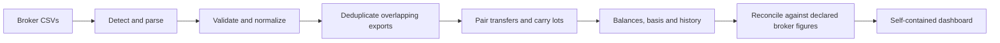

# Preserving a ledger across overlapping exports and account transfers

A financial dashboard can look plausible while counting the same assets twice.
finledger's central problem is reconstructing one checkable ledger from exports
that overlap, use different action vocabularies, and describe only one side of
some events. The examples here are independently constructed fictional data.

## A small example

An investor buys ten shares of TEST for $1,000 in account A, then transfers all
ten to account B. There is no sale. A later export from A overlaps the first
export and repeats the original buy.

| Event | Account | Quantity | Cash / acquisition basis |
| --- | --- | ---: | ---: |
| Buy TEST | A | +10 | $1,000 basis |
| Transfer out | A | −10 | Basis moves with the shares |
| Transfer in | B | +10 | Same $1,000 basis and acquisition date |
| Repeated buy in an overlapping export | A | +10 in source CSV | Same original event, not another purchase |

Summing all raw CSV rows produces an extra purchase. Treating the receiving
transfer as a new acquisition loses the original date and may invent a zero
basis. Both mistakes can survive a chart that only looks at current value.

## How the pipeline handles it

Parsers translate each source into a common schema and preserve source context.
Deduplication groups identical transactions across files while retaining the
maximum repeated count within a file. If a single statement legitimately reports
the same transaction twice, those two rows survive; a repeated export does not
multiply them. See [export.py](../src/export.py).

The basis walker preserves lots through paired transfers, including acquisition
dates. The correct final state is zero shares in A and ten in B, with the same
$1,000 basis. A transfer does not create external contributions or realized
profit. See [basis.py](../src/basis.py) and the shared
[action catalog](../src/actions.py).

The pipeline then compares its reconstruction with broker-reported figures
supplied as metadata. A mismatch remains visible with an explanation rather than
being silently adjusted to make a chart look consistent. Incomplete export
history is an input limitation, not evidence that missing basis is zero.

## What establishes confidence

- [Deduplication and export tests](../tests/test_pipeline_snapshot.py) exercise
  the pipeline using a fictional multi-broker portfolio.
- [Lot-walker parity tests](../tests/test_lot_walker_parity.py) compare independent
  consumers of the accounting rules.
- [Reconciliation tests](../tests/test_reconcile.py) check declared ground truth
  and mismatch behavior.
- Boundary regressions cover malformed input, safe publication, historical
  cutoffs, monthly sampling, and ordinary keyboard input in the dashboard.

A useful further assertion is conservation: a correctly paired internal transfer
must preserve total quantity and basis while changing their account ownership.
A later sale must not appear in an earlier historical view. These relations make
better regression tests than merely recording a screenshot or copying a total.

## Trade-offs

The system uses local CSVs instead of account credentials and a live aggregator.
That makes it portable and inspectable, but requires complete exports and explicit
account classification. A single HTML output keeps data and assets together for
local viewing; maintaining its JavaScript calculations alongside Python requires
parity tests and consistent date/observation rules.

This design is appropriate for someone willing to reconcile a reconstructed
ledger against source documents. It does not replace a broker's authoritative
records. See [Architecture](ARCHITECTURE.md) for the full implementation and
[the demo](https://akourk.github.io/finledger/) to explore fictional examples.
